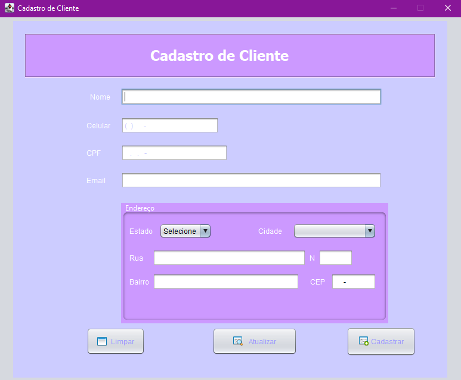
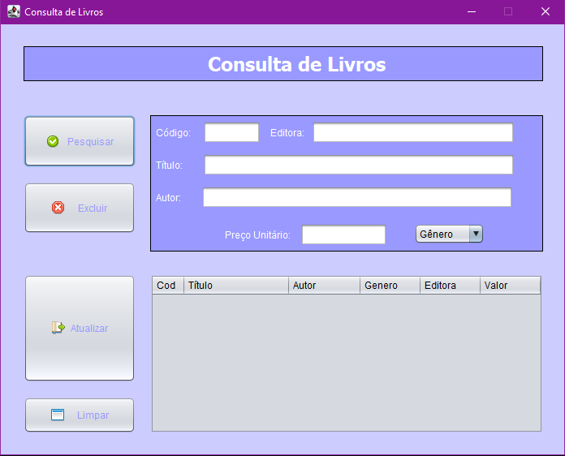
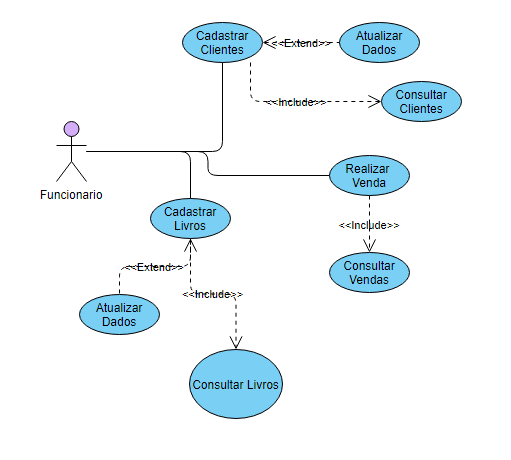

<br/>
<p align="center">
  <h3 align="center">Livraria EIRELE</h3>

  <p align="center">
    Projeto de Linguagens de Programação e Programação Orientada a Objetos</br>
<h6>Ministrado por João Paulo Aramuni e Max Vieira Santiago</br> https://github.com/joaopauloaramuni e
https://github.com/MaxVieiraSantiago </h6>
    <br/>
    <br/>
    <a href="https://github.com/Deweed/Livraria-TBFinal/issues">Report Bug</a>
    .
  </p>
</p>

    


## Sobre o Projeto

| | | |
|:--------:|:--------:|:--------:|
|   |  |  |


```
O projeto trata-se de um software para o controle de vendas de livros
de uma livraria cujo o nome e EIRELE.
Pensamos em um software que deve ser usado em livrarias fisicas, 
o sistema da apenas permissao ao funcionario, ele pode cadastrar clientes e produtos
no Banco de dados e realizar vendas e consultar vendas por cada vendedor.
```



## Feito Com

```
Java V11
MySQL
InteliJ
```

## Começando
```
Siga o passo a passo abaixo para a instalação:
```
### Pré-Requisitos

```
- JDK (Java Development Kit) versão 8 ou superior instalado.
- MySQL
- IDE Java, como Eclipse ou IntelliJ IDEA, para desenvolvimento (opcional).
```

### Instalação
```
1. Baixando o arquivo .jar:
Baixe o arquivo pelo Link https://github.com/Deweed/Livraria-TBFinal/tree/main/Projeto

2. Abra o terminal ou prompt de comando no seu sistema operacional.

3. Navegando até o diretório do arquivo .jar:
Use o comando cd no terminal para navegar até o diretório onde está localizado o 
seu arquivo .jar. Por exemplo:

cd Projeto\out\artifacts\Projeto.jar

4. Executando o arquivo .jar:
Para executar o arquivo .jar, utilize o comando java -jar, seguido do nome do arquivo 
.jar. Por exemplo:

java -jar Projeto.jar

Isso iniciará a aplicação contida no arquivo .jar.

5. Conectando ao banco de dados localmente:

Se o seu aplicativo Java dentro do .jar se conecta a um banco de dados local,
você precisa garantir que o banco de dados esteja iniciado e que as configurações 
de conexão estejam corretas no código.

6. Iniciar o servidor MySQL:
Certifique-se de que o servidor MySQL esteja em execução.

7. Criar o banco de dados:
Abra o terminal ou prompt de comando e acesse o MySQL com suas credenciais:

mysql -u seu_usuario -p

8. Crie o banco de dados necessário:

CREATE DATABASE meu_banco_de_dados;

9. Importar o esquema SQL:
No terminal, execute o seguinte comando para importar o esquema do banco de dados:

mysql -u seu_usuario -p meu_banco_de_dados < Banco_de_Dados/arquivo.sql

10. Configurando a conexão com o banco de dados:
Verifique no seu código fonte como a conexão com o banco de dados está configurada. 
Geralmente, isso envolve especificar o URL de conexão, o usuário e a senha do 
banco de dados. Exemplo em Java usando JDBC:

String url = "jdbc:mysql://localhost:3306/Livraria";
String usuario = "seu_usuario";
String senha = "sua_senha";

Connection conexao = DriverManager.getConnection(url, usuario, senha);

11. Executando a aplicação:

Após iniciar o arquivo .jar, a aplicação deve tentar conectar-se ao banco de dados 
usando as configurações fornecidas.
```

## Cronograma
```
Veja as issues abertas para uma lista de funcionalidades propostas (e problemas conhecidos).
```

## Contribuição
```
Contribuições são o que tornam a comunidade de código aberto um lugar incrível para aprender,
inspirar e criar. Todas as contribuições que você fizer são muito apreciadas.

Se você tiver sugestões para adicionar ou remover projetos, sinta-se à vontade para abrir uma 
ssue para discuti-la, ou criar diretamente um pull request após editar o arquivo README.md com
as mudanças necessárias.
Por favor, verifique sua ortografia e gramática.
Crie PR individual para cada sugestão.
Por favor, leia também o Código de Conduta antes de postar sua primeira ideia.
```

## Autores
```
Gabriel Eugenio
Estudante de Sistema da Informação
https://github.com/deweed/ 
&
Ana Carolina
Estudante de Sistema de Informação
https://github.com/carolazvd
```
